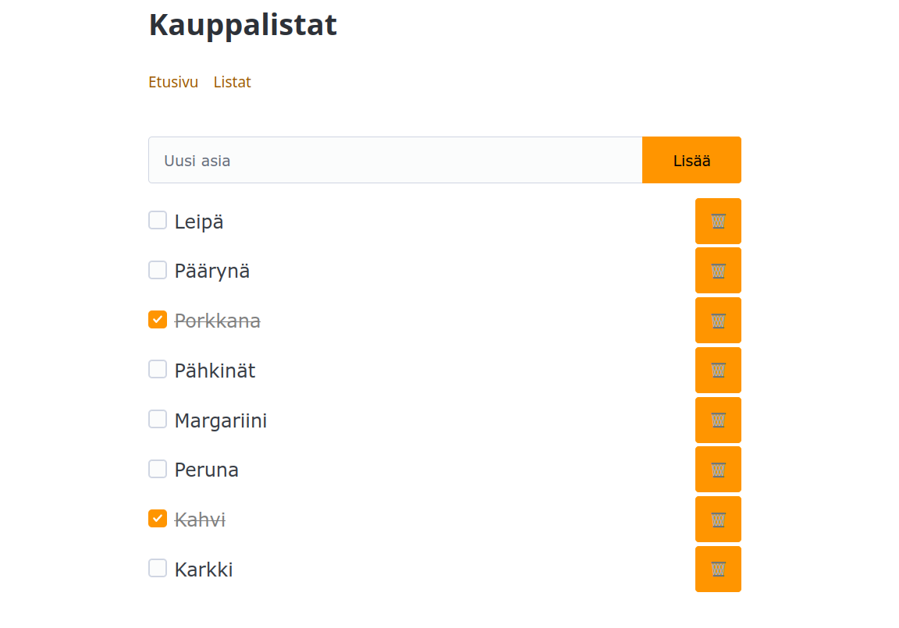
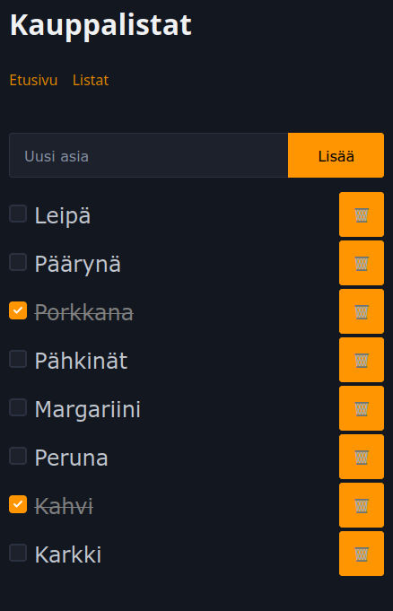

# Kauppalista24

Kauppalistasovellus koodattuna SvelteKitillä ja
PocketBase-taustajärjestelmällä.

## Kuvakaappaukset

## Asennusohje (kehitysympäristö)

1. Kloonaa tämä repositorio
2. Asenna paketit: `npm install`
   - Tämä asentaa PocketBasen ja käyttöliittymän
3. Käynnistä PocketBase ja käyttöliittymä komennolla `npm start`
4. Luo tunnukset ja kirjaudu PocketBasen hallintaan osoitteessa
   http://localhost:8090/_/
    - Luo myös PocketBasen hallinnassa yksi tai useami tyhjä kauppalista, sillä
      sovellus ei (vielä) osaa luoda niitä itse. Tämä onnistuu menemällä
      kokoelmaan (collection) `kauppalistat` ja painamalla nappia "New record"
      ja syöttämällä kenttään `nimi` haluamasi nimi.
5. Mene käyttöliittymän osoitteeseen http://localhost:5173

## Ominaisuudet

Tällä hetkellä sovellus tukee seuraavia ominaisuuksia:

* Asioiden lisääminen kauppalistaan
* Asioiden poistaminen kauppalistasta
* Asioiden merkitseminen valmiiksi
* Reaaliaikainen synkronointi useiden käyttäjien välillä

## Tunnetut ongelmat

* Asian lisääminen kauppalistalle samalla tekstillä kuin jo olemassa
  oleva asia aiheuttaa virheen, jota ei ole käsitelty.
* Sovellus ei osaa luoda kauppalistoja itse, vaan niitä pitää luoda
  PocketBasen hallinnassa.
* PocketBase:n osoite on kovakoodattu localhost:8090:ksi, joten
  sovellus ei toimi kuin paikallisessa kehitysympäristössä.

## Kehitysideoita

* Kauppalistojen luominen ja poistaminen sovelluksen kautta
* API-kutsujen reitittäminen SvelteKitin kautta PocketBaseen
  - Tällöin ei tarvittaisi CORS-asetuksia tai preflight-pyyntöjä
  - Vaihtoehtoisesti koko käyttöliittymäpuolen sovelluksen voisi
    jakaa PocketBase-palvelimelta staattisena sisältönä, jolloin
    se olisi samassa osoitteessa PocketBasen kanssa.
* Käyttäjätunnusten luominen ja kirjautuminen
* Kauppalistojen rajaaminen käyttäjäkohtaisiksi
* Kauppalistojen jakaminen muiden käyttäjien kanssa
* Asioiden muokkaaminen
* Asioiden järjestäminen
* Asioiden kategorisointi (esim. hedelmät & vihannekset, pakasteet)

## Käytetyt teknologiat

* [SvelteKit](https://kit.svelte.dev/)
* [PocketBase](https://pocketbase.io/)
* [PicoCSS](https://picocss.com/)
